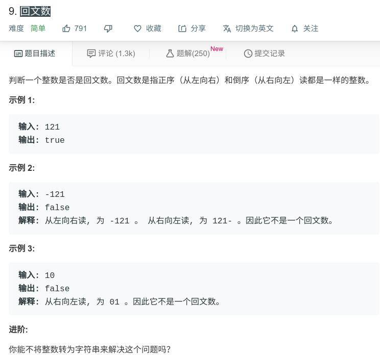

## 回文数



#### [回文数](https://leetcode-cn.com/problems/palindrome-number/)

#### 思路

1.主要需要注意当数字为负数时，直接返回false。

#### JAVA代码

```
class Solution {
    public boolean isPalindrome(int x) {
        if (x < 0){
            return false;
        }
        
        int newNum = 0;
        int temp = x;
        while(x != 0){
            newNum = newNum*10 + x%10;
            x = x/10;
        }
        if (temp==newNum){
            return true;
        }
        return false;
    }
}
```

