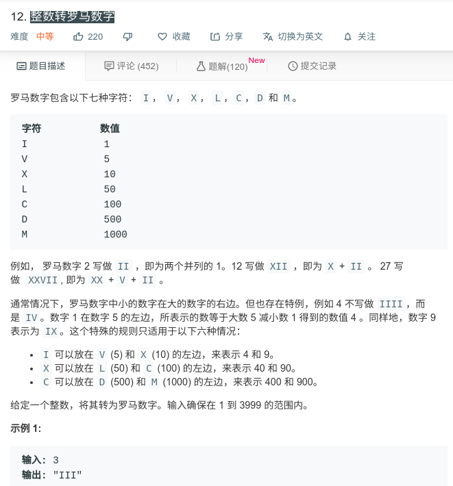

## 整数转罗马数字



#### [整数转罗马数字](https://leetcode-cn.com/problems/integer-to-roman/)

#### 思路

贪心算法

本质上整数转罗马数字就是用数组中的数字作为“加法因子”去分解一个整数，并且分解的整数个数越少越好，即**尽量使用靠前的数字**。


#### JAVA代码

```java
class Solution {
    public String intToRoman(int num) {
        int [] value = new int[]{1000,900,500,400,100,90,50,40,10,9,5,4,1};
        String[] strs=new String[]{"M","CM","D","CD","C","XC","L","XL","X","IX","V","IV","I"};
        
        String str = "";
        int index = 0;
        while (index < 13){//遍历所有数值
            while (num >= value[index]){//遍历数值次数
                num = num - value[index];
                str = str + strs[index];
            }
            index++;
        }
        return str;
    }
}
```

