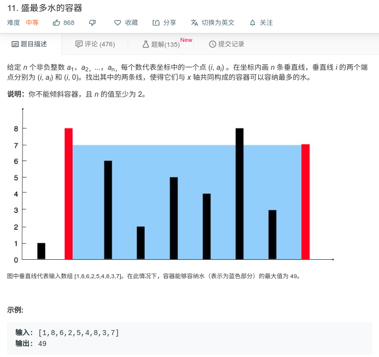

## 盛最多水的容器



#### [盛最多水的容器](https://leetcode-cn.com/problems/container-with-most-water/)思路

双指针法

这种方法背后的思路在于，两线段之间形成的区域总是会受到其中较短那条长度的限制。此外，两线段距离越远，得到的面积就越大。

我们在由线段长度构成的数组中使用两个指针，一个放在开始，一个置于末尾。 此外，我们会使用变量 maxarea来持续存储到目前为止所获得的最大面积。 在每一步中，我们会找出指针所指向的两条线段形成的区域，更新 maxarea，并将指向较短线段的指针向较长线段那端移动一步。

#### JAVA代码

```
class Solution {
    public int maxArea(int[] height) {
        int maxArea = 0;
        int start = 0;
        int end = height.length - 1;
        int temp = 0;
        while (start < end){
            if (height[start] > height[end]){
                temp = height[end] * (end - start);
                end = end -1;
            }else {
                temp = height[start] * (end - start);
                start = start + 1;
            }
            
            if (maxArea < temp){
                maxArea = temp;
            }
            
            
        }
        return maxArea;
    }
}
```

