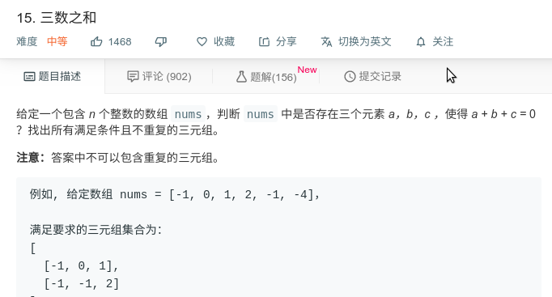

## 三数之和



#### [三数之和](https://leetcode-cn.com/problems/3sum/)

#### 思路

1. 标签：数组遍历

2. 首先对数组进行排序，排序后固定一个数nums[i]，再使用左右指针指向nums[i]后面的两端，数字分别为 nums[L] 和 nums[R]，计算三个数的和 sum 判断是否满足为 0，满足则添加进结果集

3. 如果 nums[i]大于 0，则三数之和必然无法等于 0，结束循环

4. 如果 nums[i] == nums[i−1]，则说明该数字重复，会导致结果重复，所以应该跳过

5. 当 sum == 0 时，nums[L] == nums[L+1] 则会导致结果重复，应该跳过，L++

6. 当 sum == 0 时，nums[R] == nums[R−1] 则会导致结果重复，应该跳过，R--
   时间复杂度：O(n^2)O(n^2)，n 为数组长度

   两点去重比较重要，一是i的去重，二是L和R的去重。

#### JAVA代码

```java
class Solution {
    public List<List<Integer>> threeSum(int[] nums) {
        List<List<Integer>> ans = new ArrayList();
        int len = nums.length;
        if(nums == null || len < 3) return ans;
        Arrays.sort(nums); // 排序
        for (int i = 0; i < len ; i++) {
            if(nums[i] > 0) break; // 如果当前数字大于0，则三数之和一定大于0，所以结束循环
            if(i > 0 && nums[i] == nums[i-1]) continue; // 去重
            int L = i+1;
            int R = len-1;
            while(L < R){
                int sum = nums[i] + nums[L] + nums[R];
                if(sum == 0){
                    ans.add(Arrays.asList(nums[i],nums[L],nums[R]));
                    while (L<R && nums[L] == nums[L+1]) L++; // 去重
                    while (L<R && nums[R] == nums[R-1]) R--; // 去重
                    L++;
                    R--;
                }
                else if (sum < 0) L++;
                else if (sum > 0) R--;
            }
        }        
        return ans;
    }
}

```

