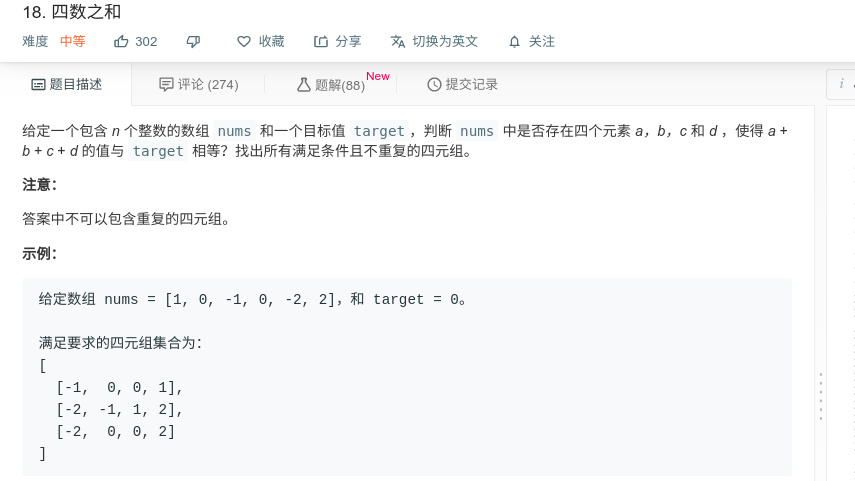

## 四数之和



#### [四数之和](https://leetcode-cn.com/problems/4sum/)

#### 思路

与三数之和类似，固定两个数，使用另外两个指针，需注意提前停止条件以及重复跳过条件。

#### JAVA代码

```java
class Solution {
    public List<List<Integer>> fourSum(int[] nums, int target) {
        List<List<Integer>> res = new ArrayList<>();
        if (nums.length < 4){
            return res;
        }
        int len = nums.length;
        Arrays.sort(nums);
        for (int i = 0; i < nums.length - 3; i++){
            if (nums[i]>target/4){
                return res;
            }
            if(i>0 && nums[i]==nums[i-1])//去重
                continue;
            for(int j=i+1;j<len-2;++j){
                if(j>i+1 && nums[j]==nums[j-1])//去重
                    continue;
                int low = j + 1;
                int high = len - 1;
                while(low < high){
                    if(nums[high]<target/4)//最大的都小于targer的1/4，后面的不用看了
                        break;
                    int sum = nums[i]+nums[j]+nums[low]+nums[high];
                    if (sum == target){
                        res.add(Arrays.asList(nums[i],nums[j],nums[low],nums[high]));
                        while(low<high && nums[low]==nums[low+1]) low++;//去重
                        while(low<high && nums[high]==nums[high-1]) high--;//去重
                        low++;
                        high--;
                    }else if(sum<target){//和小于目标值，low增大，使和增大
                        while(low<high && nums[low] == nums[low+1]) ++low;
                        low++;
                    }else{//和大于目标值，high减小，使值减小
                        while(low<high && nums[high] == nums[high-1]) --high;
                        high--;
                    }
                }
            }
        }
        return res;
    }
}

```

