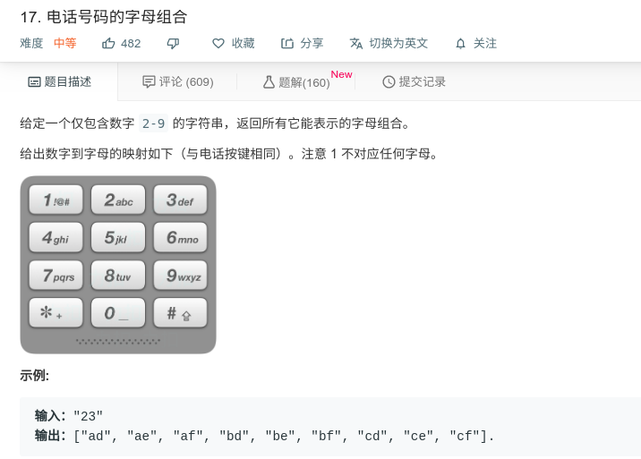
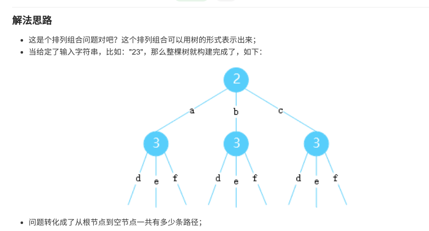

## 电话号码的字母组合



#### [电话号码的字母组合](https://leetcode-cn.com/problems/letter-combinations-of-a-phone-number/)

#### 思路

1. 方法一使用递归，递归结束条件为号码对应字母字符串为数组中的最后一个数。

   

2. 方法二使用队列，while语句结束条件为输出字符串长度与输入数字个数相同。

#### JAVA代码

```java
class Solution {
    public List<String> letterCombinations(String digits) {
        List<String> list = new ArrayList<>();
        String [] s = new String[digits.length()];
        int M = digits.length();
        if (s.length == 0){
            return list;
        }
        for (int i = 0; i < digits.length(); i++){
            switch (digits.charAt(i)){
                case '2':s[i]="abc";break;
                case '3':s[i]="def";break;
                case '4':s[i]="ghi";break;
                case '5':s[i]="jkl";break;
                case '6':s[i]="mno";break;
                case '7':s[i]="pqrs";break;
                case '8':s[i]="tuv";break;
                case '9':s[i]="wxyz";break;
            }
        }
        list=getStringWithFor(s,0,list,"");
        return list;
    }
    
    public List<String> getStringWithFor(String []s,int i,List<String> list,String stemp) {
        if (i < s.length - 1){
            for (int j = 0; j < s[i].length(); j++){
                list=getStringWithFor(s,i+1,list,stemp+s[i].charAt(j));
            }
            i++;
        }else {
            for (int j = 0; j < s[i].length(); j++){
                list.add(stemp+s[i].charAt(j));
            }
        }
        return list;
    }
}

```

```java
public List<String> letterCombinations(String digits) {
		LinkedList<String> ans = new LinkedList<String>();
		if(digits.isEmpty()) return ans;
		String[] mapping = new String[] {"0", "1", "abc", "def", "ghi", "jkl", "mno", "pqrs", "tuv", "wxyz"};
		ans.add("");
		for(int i =0; i<digits.length();i++){
			int x = Character.getNumericValue(digits.charAt(i));
			while(ans.peek().length()==i){
				String t = ans.remove();
				for(char s : mapping[x].toCharArray())
					ans.add(t+s);
			}
		}
		return ans;
	}
}
```

