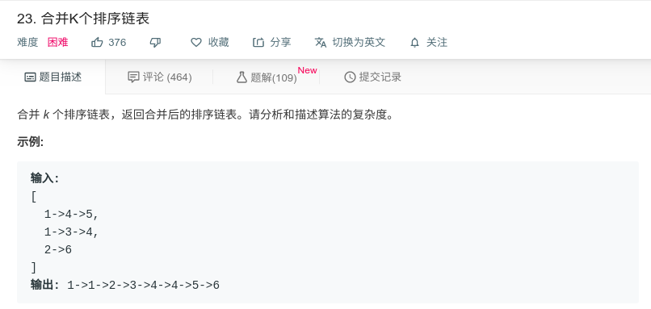

## 合并K个排序链表



#### [合并K个排序链表](https://leetcode-cn.com/problems/merge-k-sorted-lists/)

#### 思路

算法原理

使用优先级队列，优先级队列中保存K个链表的头结点。

然后新建立一个头结点，由头结点的链表指向K个链表中的值为最小的。再将最小的节点的下一个保存到优先级队列中。


```java
/**
 * Definition for singly-linked list.
 * public class ListNode {
 *     int val;
 *     ListNode next;
 *     ListNode(int x) { val = x; }
 * }
 */
class Solution {
    public ListNode mergeKLists(ListNode[] lists) {
        if (lists.length == 0){
            return null;
        }
        ListNode dummyHead = new ListNode(0);
        ListNode curr = dummyHead;
        PriorityQueue<ListNode> pq = new PriorityQueue<>(new Comparator<ListNode>(){
            public int compare(ListNode o1, ListNode o2){
                return o1.val - o2.val;
            }
        });
        
        for (ListNode list : lists){
            if (list == null){
                continue;
            }
            pq.add(list);
        }
        
        while (!pq.isEmpty()) {
            ListNode nextNode = pq.poll();
            curr.next = nextNode;
            curr = curr.next;
            if (nextNode.next != null) {
                pq.add(nextNode.next);
            }
        }
        return dummyHead.next;
    }
}
```

