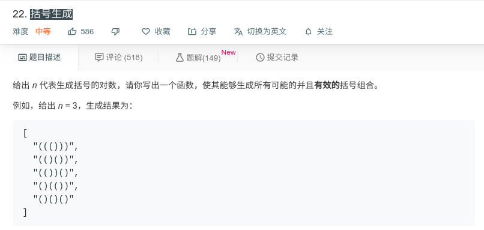

## 括号生成



#### [括号生成](https://leetcode-cn.com/problems/generate-parentheses/)

#### 思路

方法一算法原理

递归找到所有可能的结果，例如n=3，还需要找到'(((((('这种结果，但这种结果最终不符合要求，需要进行判别，即左括号使flag加一，右括号使flag减一，在途中flag不能小于0，即需要满足左括号的个数不少于右括号的个数。

```java
class Solution {
    public List<String> generateParenthesis(int n) {
        List<String> res = new ArrayList();
        generateAll(new char[2 * n], 0, res);
        return res;
    }
    
    public void generateAll(char[] current, int pos, List<String> result){
        if (pos == current.length){
            if (valid(current)){
                result.add(new String(current));
            }
        }else{
            current[pos] = '(';
            generateAll(current, pos+1, result);
            current[pos] = ')';
            generateAll(current, pos+1, result);
        }
    }
    
    public boolean valid(char[] current) {
        int balance = 0;
        for (char c: current) {
            if (c == '(') balance++;
            else balance--;
            if (balance < 0) return false;//判断是否满足条件
        }
        return (balance == 0);
    }
}
```

方法二原理

只有在我们知道序列仍然保持有效时才添加 '(' or ')'，而不是像 方法一 那样每次添加。我们可以通过跟踪到目前为止放置的左括号和右括号的数目来做到这一点，

**如果我们还剩一个位置，我们可以开始放一个左括号。 如果它不超过左括号的数量，我们可以放一个右括号。**


```java
class Solution {
    public List<String> generateParenthesis(int n) {
        List<String> ans = new ArrayList();
        backtrack(ans, "", 0, 0, n);
        return ans;
    }

    public void backtrack(List<String> ans, String cur, int open, int close, int max){
        if (cur.length() == max * 2) {
            ans.add(cur);
            return;
        }

        if (open < max)
            backtrack(ans, cur+"(", open+1, close, max);
        if (close < open)
            backtrack(ans, cur+")", open, close+1, max);
    }
}
```

