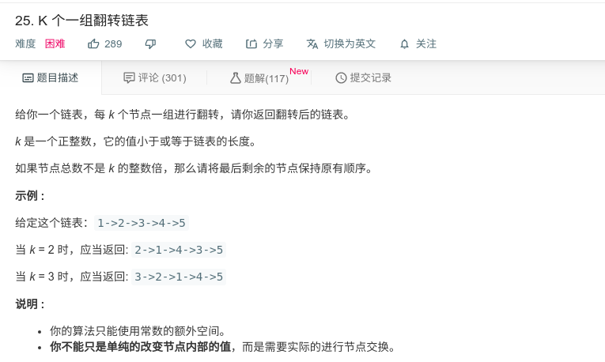
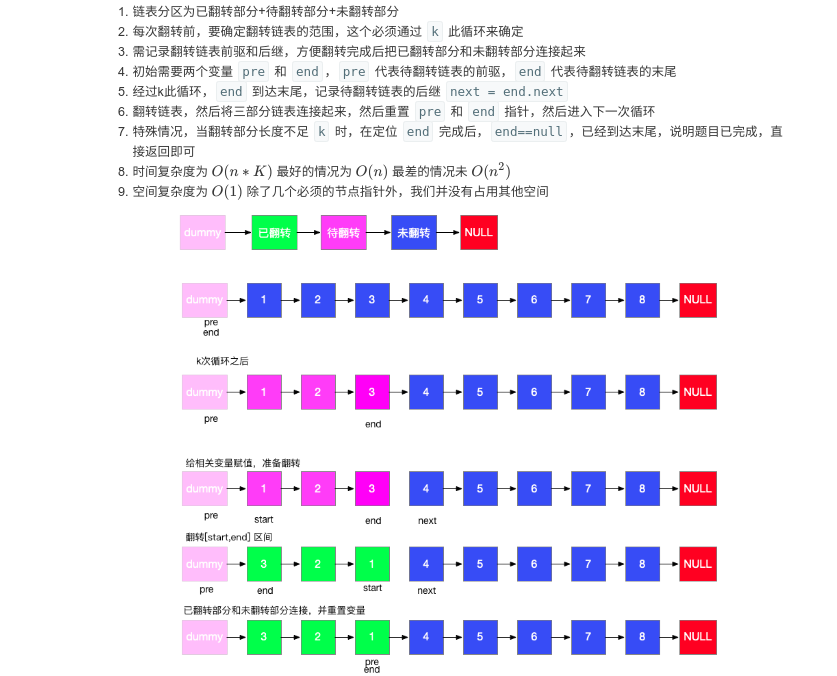

## K个一组反转链表



#### [K 个一组翻转链表](https://leetcode-cn.com/problems/reverse-nodes-in-k-group/)

#### 思路



```java
/**
 * Definition for singly-linked list.
 * public class ListNode {
 *     int val;
 *     ListNode next;
 *     ListNode(int x) { val = x; }
 * }
 */
class Solution {
    public ListNode reverseKGroup(ListNode head, int k) {
        ListNode dummy = new ListNode(0);
        dummy.next = head;
        
        ListNode start = dummy;
        ListNode end = dummy;
        
        while (end.next != null){
            for (int i = 0; i < k && end != null; i++){
                end = end.next;
            }
            
            if (end == null){
                break;
            }
            ListNode next = end.next;
            ListNode pre = start.next;       
            end.next = null;
            start.next = reverse(pre);
            pre.next = next;
            start = pre;
            end = start;
        }
        return dummy.next;

    }
    public ListNode reverse(ListNode head) {
        ListNode pre = null;
        ListNode cur = head;
        while (cur != null){
            ListNode next = cur.next;
            cur.next = pre;
            pre = cur;
            cur = next;
        }
        return pre;
    }
}
```

