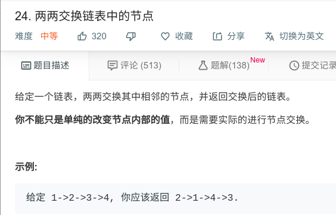

## 两两交换链表中的节点



#### [两两交换链表中的节点](https://leetcode-cn.com/problems/swap-nodes-in-pairs/)

#### 思路

算法原理

建立一个新节点，指向头结点。然后进行两两交换操作。

```java
/**
 * Definition for singly-linked list.
 * public class ListNode {
 *     int val;
 *     ListNode next;
 *     ListNode(int x) { val = x; }
 * }
 */
class Solution {
    public ListNode swapPairs(ListNode head) {
        ListNode temp = new ListNode(0);
        temp.next = head;
        ListNode temp1 = temp;

        while (temp != null && temp.next != null && temp.next.next != null) {
            reverse(temp, temp.next);
            temp = temp.next.next;
        } 
        return temp1.next;
    }
    public void reverse(ListNode head, ListNode cur){
        ListNode tail = cur.next.next;
        head.next = cur.next;
        cur.next.next = cur;
        cur.next = tail;
    }
}
```

