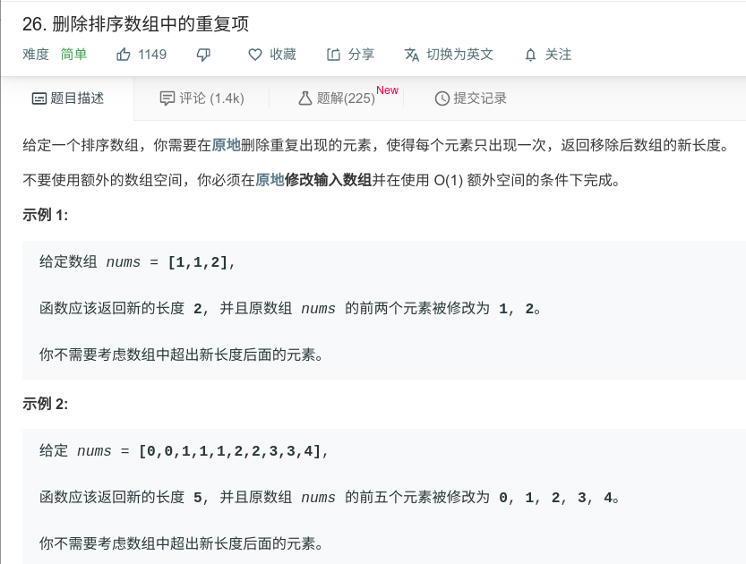

## 删除排序数组中的重复项



#### [删除排序数组中的重复项](https://leetcode-cn.com/problems/remove-duplicates-from-sorted-array/)

#### 思路

双指针法。

```java
class Solution {
    public int removeDuplicates(int[] nums) {
        int i = 0;
        int j = 1;
        while (j < nums.length){
            if (nums[i] == nums[j]){
                j++;
            }else{
                i++;
                nums[i] = nums[j];
                j++;
            }
        }
        return i+1;
    }
}
```

