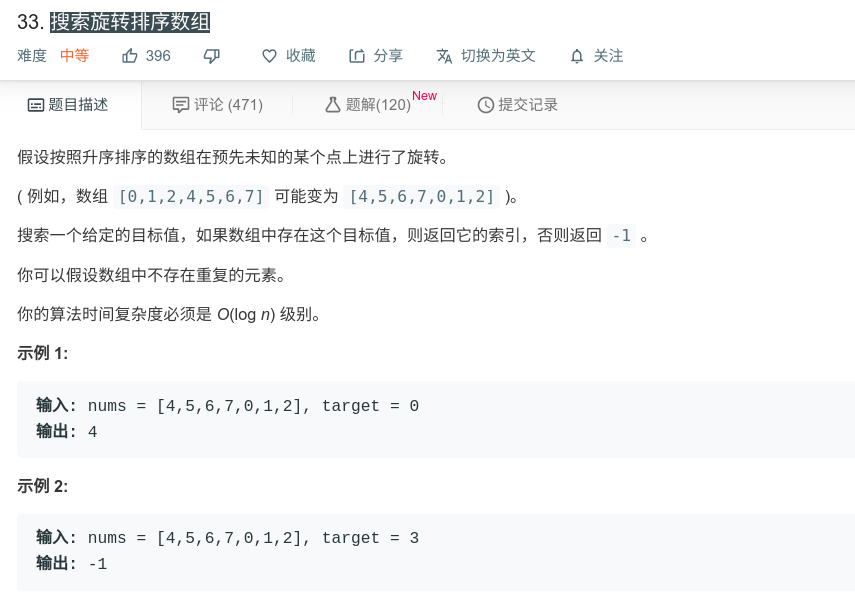

## 搜索旋转排序数组



#### [搜索旋转排序数组](https://leetcode-cn.com/problems/search-in-rotated-sorted-array/)

#### 思路

二分法，数组有两种情况：

第一种，[2,3,4,5,6,7,1]，这时，若start < mid ，则前边有序，判断是否在前半部分。

第二种，[7,1,2,3,4,5,6] ，这时，若mid < end，则后半部分有序，判断是否在后半部分。

```java
class Solution {
    public int search(int[] nums, int target) {
        int start = 0;
        int end = nums.length - 1;
        int mid;
        while (start <= end){
            mid = start + (end - start)/2;
            if (nums[mid] == target){
                return mid;
            }
            if (nums[start] <= nums[mid]){
                if (target >= nums[start] && target < nums[mid]){
                    end = mid - 1;
                }else{
                    start = mid + 1;
                }
            }else{
                if (target <= nums[end] && target > nums[mid]){
                    start = mid + 1;
                }else{
                    end = mid - 1;
                }
            }
        }
        return -1;
    }
}

```

