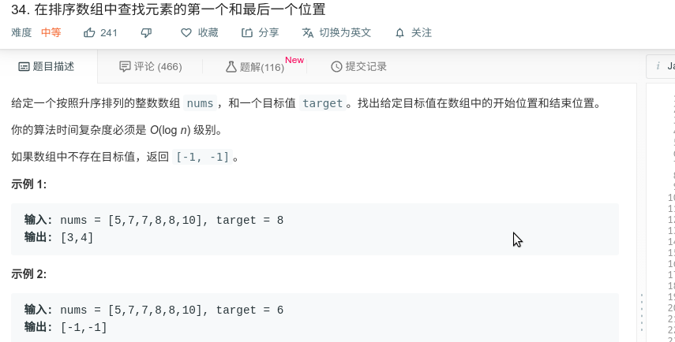

## 在排序数组中查找元素的第一个和最后一个位置



#### [在排序数组中查找元素的第一个和最后一个位置](https://leetcode-cn.com/problems/find-first-and-last-position-of-element-in-sorted-array/)


#### 思路

使用二分查找，利用`target == nums[mid]` 的特性分别查找target的左边界与target的右边界。

```java
class Solution {
    public int[] searchRange(int[] nums, int target) {
        int[] targetRange = {-1, -1};
        int leftIdx = extremeInsertionIndex(nums, target, true);
        if (leftIdx == nums.length || nums[leftIdx] != target) {
            return targetRange;
        }

        targetRange[0] = leftIdx;
        targetRange[1] = extremeInsertionIndex(nums, target, false)-1;

        return targetRange;
    }
    private int extremeInsertionIndex(int[] nums, int target, boolean left) {
        int lo = 0;
        int hi = nums.length;
        
        while (lo < hi){
            int mid = (lo + hi)/2;
            if (nums[mid] > target || (left && target == nums[mid])){
                hi = mid;
            }else{
                lo = mid + 1;
            }
        }
        return lo;
    }
}
```

