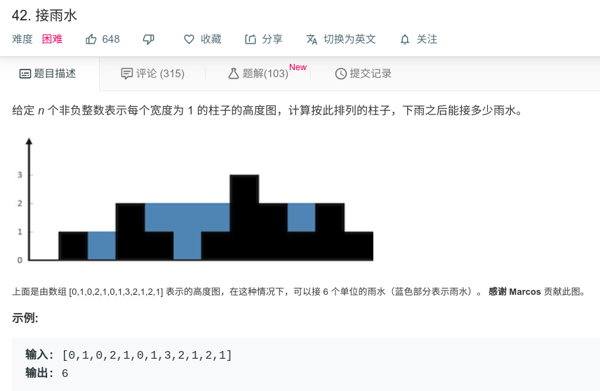

## 接雨水



#### [42. 接雨水](https://leetcode-cn.com/problems/trapping-rain-water/)

#### 思路

动态规划：

按列进行累加，每列的值等于本列左边最高点与本列右边最高点中的较低的那一个减去本列的值。

先用设置两个数组，分别保存每列左边的最大值和每列右边的最大值。然后进行遍历得到总和。

```java
class Solution {
    public int trap(int[] height) {
        int sum = 0;
        int[] max_left = new int[height.length];
        int[] max_right = new int[height.length];
        
        for (int i = 1; i < height.length -1; i++){
            max_left[i] = Math.max(max_left[i-1],height[i-1]);
        }
        for (int i = height.length - 2; i >= 0; i--) {
            max_right[i] = Math.max(max_right[i + 1], height[i + 1]);
        }
        
        for (int i = 1; i < height.length-1; i++){
            int min = Math.min(max_left[i], max_right[i]);
            if (min > height[i]){
                sum = sum + (min - height[i]);
            }
        }
        return sum;
    }
}


```

