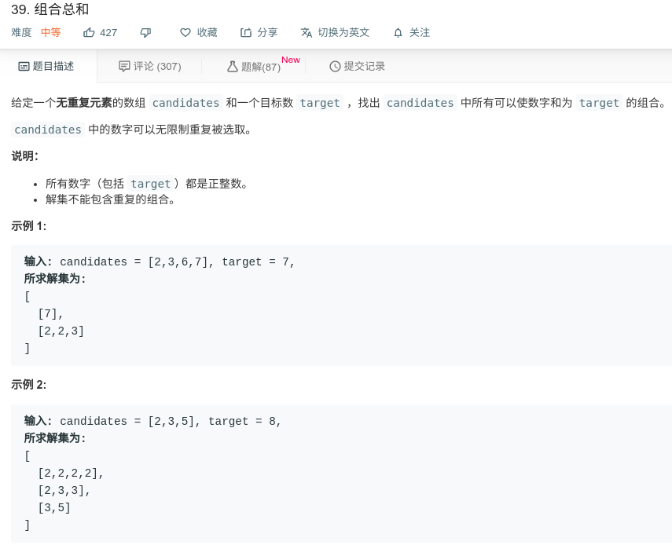

## 数组总和



#### [组合总和](https://leetcode-cn.com/problems/combination-sum/)

[组合总和思路](https://leetcode-cn.com/circle/article/GV6eQ2/)

#### 思路

递归：

当target小于0时，递归结束。

当target等于0时，满足条件，加入lists；

当target大于0时，从当前数字还是循环递归。递归结束将加入列表的元素取出。

```java
class Solution {
    List<List<Integer>> lists = new ArrayList<>();
    public List<List<Integer>> combinationSum(int[] candidates, int target) {
        List<Integer> list = new ArrayList<>();
        process(0,candidates,target,list);
        return lists;
    }
    
    private void process(int start, int[] candidates, int target, List<Integer> list) {
        if (target < 0){
            return ;
        }
        if (target == 0){
            lists.add(new ArrayList<>(list));
        }else{
            for (int i = start; i < candidates.length; i++){
                list.add(candidates[i]);
                //因为每个数字都可以使用无数次，所以递归还可以从当前元素开始
                process(i, candidates, target - candidates[i], list);
                list.remove(list.size() - 1);
            }
        }
    }
}
```

