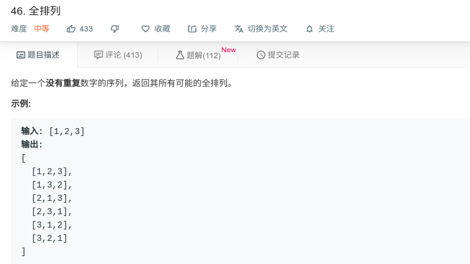

## 全排列



#### [46. 全排列](https://leetcode-cn.com/problems/permutations/)


#### 思路

本题需要使用递归回溯，先考虑递归结束条件，当list的length等于数组序列时，则将本list加入结果集中，并return。

在其他情况下，需通过设置一个位置数组来标记数组序列中的数字是否已经用过，用过则跳过。否则进入递归。递归结束后需将结果集和位置数组中的本次加入清空。

```java
class Solution {
    public List<List<Integer>> permute(int[] nums) {

        List<List<Integer>> res = new ArrayList<>();
        int[] visited = new int[nums.length];
        backtrack(res, nums, new ArrayList<Integer>(), visited);
        return res;

    }

    private void backtrack(List<List<Integer>> res, int[] nums, ArrayList<Integer> tmp, int[] visited) {
        if (tmp.size() == nums.length) {
            res.add(new ArrayList<>(tmp));
            return;
        }
        for (int i = 0; i < nums.length; i++) {
            if (visited[i] == 1) continue;
            visited[i] = 1;
            tmp.add(nums[i]);
            backtrack(res, nums, tmp, visited);
            visited[i] = 0;
            tmp.remove(tmp.size() - 1);
        }
    }
}


```

