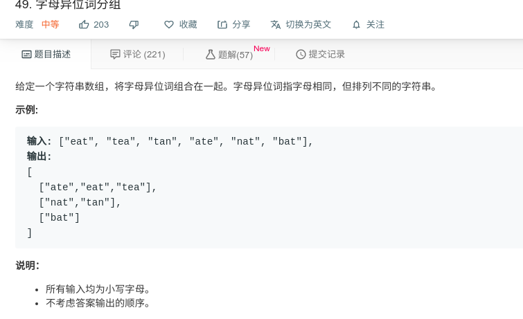

## 字母异位词分组



#### [字母异位词分组](https://leetcode-cn.com/problems/group-anagrams/)

#### 思路

本题可先建立一张哈希表，其`key` 值为排序后的字母异位词类别，`value` 为词的`list` ，每次先判断排序后的字母异位词是否在`key` 中出现，若出现则将其存在`value` 的`list` 中，否则新建`key，value` 对。

```java
class Solution {
    public List<List<String>> groupAnagrams(String[] strs) {
        HashMap<String, List<String>> hash = new HashMap<>();
        for (int i = 0; i < strs.length; i++){
            char[] s_arr = strs[i].toCharArray();
            Arrays.sort(s_arr);
            String key = String.valueOf(s_arr);
            if (hash.containsKey(key)){
                hash.get(key).add(strs[i]);
            }else{
                List<String> temp = new ArrayList<String>();
                temp.add(strs[i]);
                hash.put(key, temp);
            }
        }
        return new ArrayList<List<String>>(hash.values()); 

    }
}


```

