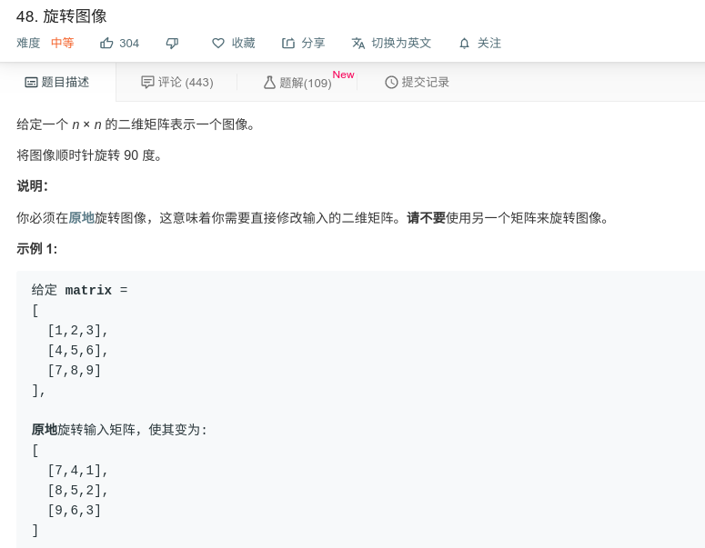

## 旋转图像



#### [旋转图像](https://leetcode-cn.com/problems/rotate-image/)

#### 思路

本题具有规律性，主要使用两个while循环，一个用于控制圈数，一个用于控制圈内旋转。

刚开始，假设一个5*5的数组，然后先旋转四个角的元素，这个很简单，简单排序算法中两个元素交换的延申而已。然后尝试交换下一组元素，我交换完成外圈元素时，发现了很有规律的现象： 当我们把数组值的行列下标对应到坐标系中时，可以将各元素，看做一个点，那么整个坐标系中有四个点。四个点的规律如下：四个点绝对向一个方向移动，且有一个下标保持不变。

1. 左上角的点，绝对向右移动，
2. 右上角的点，绝对向下移动，
3. 右下角的点，绝对向左移动，
4. 左下角的点，绝对向上移动，

- 归纳得到有两个固定不变的值，其对应在第一次旋转中，分别是0和matrix.length。
- 剩余两个变化的值也有规律，分别是两个运动轨迹:从0->matrix.length和从matrix.length->0
- 提取运动轨迹间的关系，就能通过循环，完成第一圈旋转
- 开始内圈旋转的时候，变换固定值，约束内圈，返回到开始的思路，继续旋转

```java
class Solution {
    public static void rotate(int[][] matrix) {
            int abs1 = 0;
            int abs2 = matrix.length - 1;
            int times = 0;
            while (abs1 <= abs2) {
                int p1 = abs1;
                int p2 = abs2;
                while (p1 != abs2) {
                    int temp = matrix[abs1][p1];        //左上
                    matrix[abs1][p1] = matrix[p2][abs1];//左上 = 左下
                    matrix[p2][abs1] = matrix[abs2][p2];//左下 = 右下
                    matrix[abs2][p2] = matrix[p1][abs2];//右下 = 右上
                    matrix[p1][abs2] = temp;            //右上 = 左上
                    p1 += 1;
                    p2 -= 1;
                }
                abs1 += 1;
                abs2 -= 1;
            }
    }
}


```

