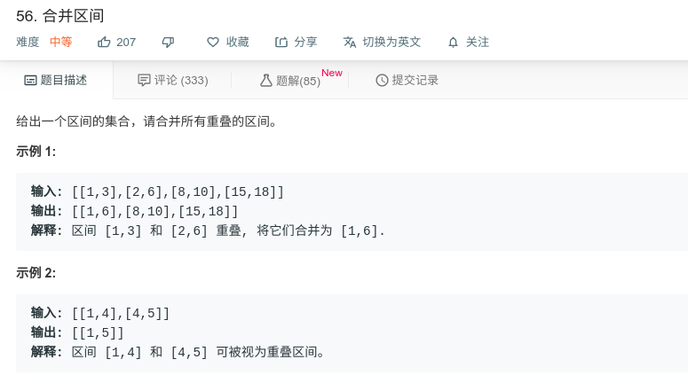

## 合并区间



#### [56. 合并区间](https://leetcode-cn.com/problems/merge-intervals/)

#### 思路

首先先对输入的数组序列按左边界进行排序，然后进行两层while循环，第一层用于遍历每个边界数组，第二个while用于判断是否能合并两个边界数组。

```java
class Solution {
    public int[][] merge(int[][] arr) {
        if(arr == null || arr.length<=1){
            return arr;
        }
        
        List<int[]> list = new ArrayList<>();
        Arrays.sort(arr, new Comparator<int[]>(){
            @Override
            public int compare(int[] a, int[] b){
                return a[0]-b[0];
            }
        });
        
        int i = 0;
        int n = arr.length;
        while(i < n){
            int left = arr[i][0];
            int right = arr[i][1];
            while(i < n-1 && right>=arr[i+1][0]){
                right = Math.max(right, arr[i+1][1]);
                i++;
            }
            list.add(new int[] {left,right});
            i++;
        }
        return list.toArray(new int[list.size()][2]);
    }
}
```

