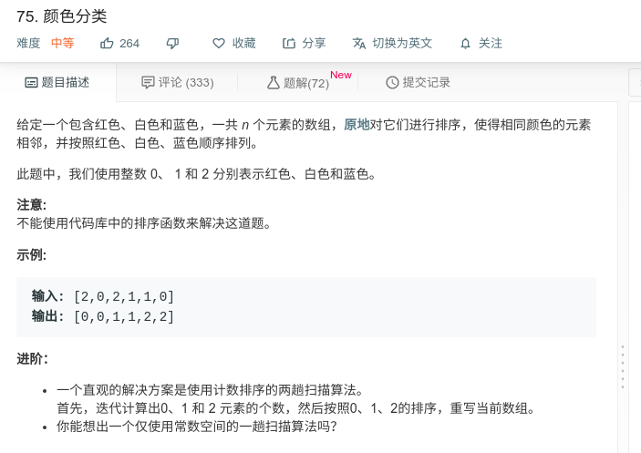

## 颜色分类



#### [75. 颜色分类](https://leetcode-cn.com/problems/sort-colors/)

#### 思路

设置两个变量`r1,r2`，`r1`左边的值都小于1,`r2`左边的值都小于2。 初始化是他们都等于-1，遍历数组，先判断当前数是否小于2，若小于，则`r2++`，并使`r2`与当前数交换。然后再判断交换后的当前数是否小于1。举例：

假设现在有数组nums = [0,0,1,1,2,0,0],r1 = 1,r2 = 3。下一个数组索引i是5，也就是要处理0，这个数是小于2的。

因此r2+1，代表区间扩大，把nums[i]和nums[r2]交换。此时维持了r2左侧的数都是小于2的这个性质。

交换完之后，这个小于2的数存放在了nums[r2]，但是这个nums[r2]仍然有可能小于1，若是小于1，那么

应该把r1+1，代表区间扩大，然后把nums[r1]和nums[r2]交换，这样才能维持r1左侧的数小于1的这个性质。

```java
class Solution {
    public void sortColors(int[] nums) {
        
        int r1 = -1;
        int r2 = -1;
        for(int i = 0;i < nums.length;i++){
            if(nums[i] < 2)
            {
                r2++;
                swap(nums,i,r2);
                if(nums[r2] < 1)
                {
                    r1++;
                    swap(nums,r1,r2);
                }
            }
            
        }
    }
    
    void swap(int[]nums,int i,int j)
    {
        int temp = nums[i];
        nums[i] = nums[j];
        nums[j] = temp;
    }
}
```

