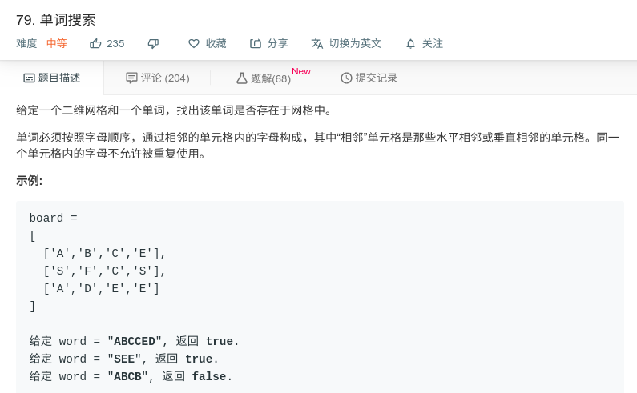

## 单词搜索



#### [79. 单词搜索](https://leetcode-cn.com/problems/word-search/)

#### 思路

使用回溯算法，遍历数组中的每一个元素，使每一个元素作为一次开头进行回溯。

返回条件：

当数组越界，或当前数组位置与需要比对的某一位字母不相等，则表示这条搜索路行不通，返回false

若匹配成功则有两种情况， 情况一：当前字母是字符串最后一位，则代表比对完毕，返回true

情况二：还没比对完毕，则继续比对，有上、下、左、右四条路继续暴搜，当前数组位置的字母已经使用过了,则换成其他字母，表示不允许被重复使用。

```java
class Solution {
     //用作位移 上下左右 比如 横坐标+0，纵坐标+1, 则表示在二维数组中是向上走
    private static int[] row = new int[]{0, 1, 0, -1};
    private static int[] column = new int[]{1, 0, -1, 0};

    public boolean exist(char[][] board, String word) {

        for (int i = 0, rowLen = board.length; i < rowLen; i++) {
            for (int j = 0, columnLen = board[0].length; j < columnLen; j++) {
                // 深度搜索遍历 二维数组的每一个字母都可以作为起点
                if (dfs(i, j, board, word, 0)) return true;
            }
        }
        return false;
    }

    //横坐标x，纵坐标y，比对到了字符串的第几位字母(index)
    public static Boolean dfs(int x, int y, char[][] board, String word, int index) {
        //考虑越界等条件
        if (x >= board.length || x < 0 || y < 0 || y >= board[0].length) return false;

        // 如果当前数组位置与需要比对的某一位字母不相等，则表示这条搜索路行不通，返回false
        if (board[x][y] != word.charAt(index)) return false;

        //如果匹配成功则有两种情况， 情况一：当前字母是字符串最后一位，则代表比对完毕，返回true
        if (index == word.length() - 1) return true;

        //情况二：还没比对完毕，则继续比对，有上、下、左、右四条路继续暴搜
        //当前数组位置的字母已经使用过了,则换成其他字母，表示不允许被重复使用
        board[x][y] = '.';
        for (int i = 0; i < 4; i++) {
            //利用代码开头的两个数组，通过循环4次遍历4个方向来继续搜索
            if (dfs(x + row[i], y + column[i], board, word, index + 1)) return true;

        }
        //搜索完一个方向后要记得把状态恢复，来进行下一个方向的搜索，简称 回溯
        board[x][y] = word.charAt(index);
        return false;
    }
}

```

