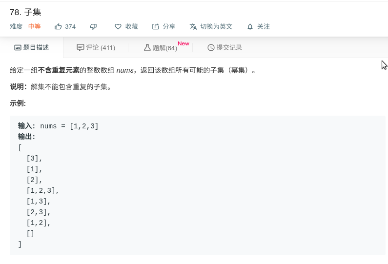

## 子集



#### [78. 子集](https://leetcode-cn.com/problems/subsets/)

#### 思路

使用循环，每次向已保存的结果中添加一个数形成新的结果再保存。

```java
class Solution {
    public List<List<Integer>> subsets(int[] nums) {
        List<List<Integer>> res = new ArrayList<>();
        res.add(new ArrayList<>());
        for (int i = 0; i < nums.length; i++) {
            int all = res.size();
            System.out.println(all);
            for (int j = 0; j < all; j++) {
                System.out.println("=========");
                System.out.println(j);
                System.out.println(res.get(j));
                List<Integer> tmp = new ArrayList<>(res.get(j));
                tmp.add(nums[i]);
                res.add(tmp);
            }
        }
        return res;
    }
}
```

递归

[1]
[1, 2]
[1, 2, 3]
[1, 3]
[2]
[2, 3]
[3]

对数组中每个位置都进行for循环遍历。

```java
class Solution {
    public List<List<Integer>> subsets(int[] nums) {
        List<List<Integer>> res = new ArrayList<>();
        backtrack(0, nums, res, new ArrayList<Integer>());
        return res;

    }

    private void backtrack(int i, int[] nums, List<List<Integer>> res, ArrayList<Integer> tmp) {
        res.add(new ArrayList<>(tmp));
        for (int j = i; j < nums.length; j++) {
            tmp.add(nums[j]);
            backtrack(j + 1, nums, res, tmp);
            tmp.remove(tmp.size() - 1);
        }
    }
}
```

