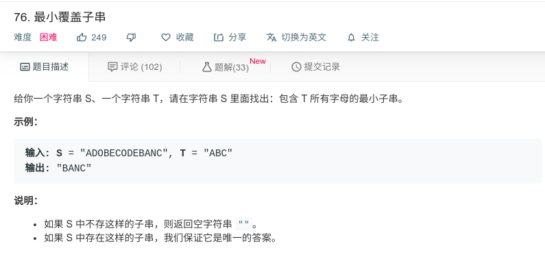

## 最小覆盖子串



#### [76. 最小覆盖子串](https://leetcode-cn.com/problems/minimum-window-substring/)

#### 思路

双指针，创建left和right指针，right指针指向满足字符串的最后一个字符，当满足之后，left加一，若不满足，right加一。

```java
class Solution {
    public String minWindow(String s, String t) { 
        Map<Character, Integer> map = new HashMap<>();
        //遍历字符串 t，初始化每个字母的次数
        for (int i = 0; i < t.length(); i++) {
            char char_i = t.charAt(i);
            map.put(char_i, map.getOrDefault(char_i, 0) + 1);
        }
        int left = 0; //左指针
        int right = 0; //右指针
        int ans_left = 0; //保存最小窗口的左边界
        int ans_right = -1; //保存最小窗口的右边界
        int ans_len = Integer.MAX_VALUE; //当前最小窗口的长度
        //遍历字符串 s
        while (right < s.length()) {
            char char_right = s.charAt(right);
            //判断 map 中是否含有当前字母
            if (map.containsKey(char_right)) {
                //当前的字母次数减一
                map.put(char_right, map.get(char_right) - 1);
                //开始移动左指针，减小窗口
                while (match(map)) { //如果当前窗口包含所有字母，就进入循环
                    //当前窗口大小
                    int temp_len = right - left + 1;
                    //如果当前窗口更小，则更新相应变量
                    if (temp_len < ans_len) {
                        ans_left = left;
                        ans_right = right;
                        ans_len = temp_len;
                    }
                    //得到左指针的字母
                    char key = s.charAt(left);
                    //判断 map 中是否有当前字母
                    if (map.containsKey(key)) {
                        //因为要把当前字母移除，所有相应次数要加 1
                        map.put(key, map.get(key) + 1);
                    }
                    left++; //左指针右移
                }
            }
            //右指针右移扩大窗口
            right++;
        }
        return s.substring(ans_left, ans_right+1);
    }

    //判断所有的 value 是否为 0
    private boolean match(Map<Character, Integer> map) {
        for (Integer value : map.values()) {
            if (value > 0) {
                return false;
            }
        }
        return true;
    }
}
```

