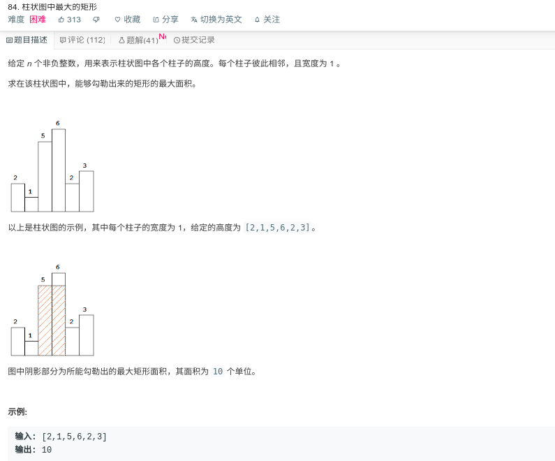

## 柱状图中最大的矩形



#### [84. 柱状图中最大的矩形](https://leetcode-cn.com/problems/largest-rectangle-in-histogram/)

#### 思路

使用栈，遍历数组，若当前数大于栈顶，则压入栈，否则，根据`heights[stack.pop()] * (i - stack.peek() - 1)`计算栈顶位置的最大矩形，压入栈代表左边界，弹出时代表右边界。

在最后，若栈不为空，则根据`heights.length - stack.peek() -1)`计算剩余位置最大矩形

```java
public class Solution {
    public int largestRectangleArea(int[] heights) {
        Stack < Integer > stack = new Stack < > ();
        stack.push(-1);
        int maxarea = 0;
        for (int i = 0; i < heights.length; ++i) {
            while (stack.peek() != -1 && heights[stack.peek()] >= heights[i])
                maxarea = Math.max(maxarea, heights[stack.pop()] * (i - stack.peek() - 1));
            stack.push(i);
        }
        while (stack.peek() != -1)
            maxarea = Math.max(maxarea, heights[stack.pop()] * (heights.length - stack.peek() -1));
        return maxarea;
    }
}
```

