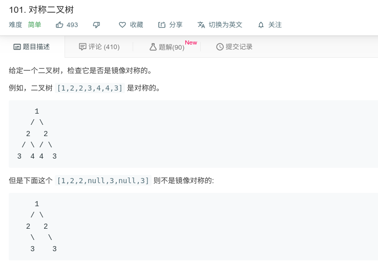

## 对称二叉树



#### [101. 对称二叉树](https://leetcode-cn.com/problems/symmetric-tree/)

#### 思路

递归，每次进入左子树的左节点与右子数的右节点，和左子树的右节点与右子数的左节点。

递归结束条件，1.若两者都为null，返回true；2.一个为null，一个不为，返回false；3.两数值不相等，返回false。

```java
class Solution {
    public boolean isSymmetric(TreeNode root) {
        if (root == null) return true;
        return isSym(root.left, root.right);
    }
    
    private boolean isSym(TreeNode t1, TreeNode t2){
		if(t1 == null && t2 == null) return true;
		if(t1 == null || t2 == null) return false;
		if(t1.val != t2.val) return false;
        return isSym(t1.left, t2.right) && isSym(t1.right, t2.left);
    }
}
```

