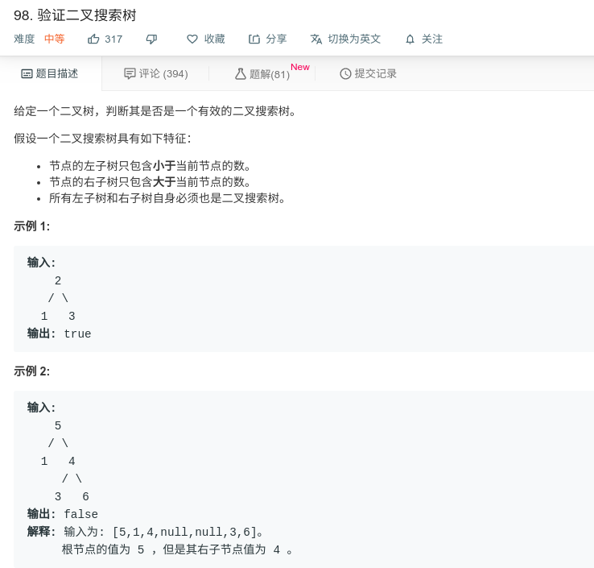

## 验证二叉搜索树



#### [98. 验证二叉搜索树](https://leetcode-cn.com/problems/validate-binary-search-tree/)

#### 思路

递归，二叉树的中序遍历为递增的。

```java
class Solution {
    long max = Long.MIN_VALUE;
    public boolean isValidBST(TreeNode root) {
        if (root == null){
            return true;
        }
        return isValidBST(root.left) && visit(root) && isValidBST(root.right);
        
    }
    
    public boolean visit(TreeNode root){
        if (root.val > max){
            max = root.val;
            return true;
        }else{
            return false;
        }
    }
    
}
```

