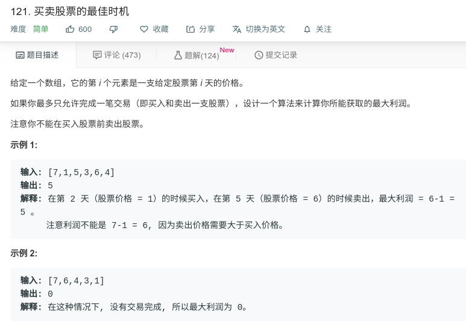

## 买卖股票的最佳时机



#### [121. 买卖股票的最佳时机](https://leetcode-cn.com/problems/best-time-to-buy-and-sell-stock/)

#### 思路

使用动态规划，即当前最大值等于max(之前最大值，当前值-之前最小值)

我们可以维持两个变量——minprice 和 maxprofit，它们分别对应迄今为止所得到的最小的谷值和最大的利润（卖出价格与最低价格之间的最大差值）。S

```java
class Solution {
    public int maxProfit(int[] prices) {
        int maxPr = 0;
        int minPr = Integer.MAX_VALUE;
        for (int i = 0; i < prices.length; i++){
            if (prices[i] > minPr){
                maxPr = Math.max(maxPr, prices[i] - minPr);
            }else{
                minPr = prices[i];
            }
        }
        return maxPr;
    }
}
```

