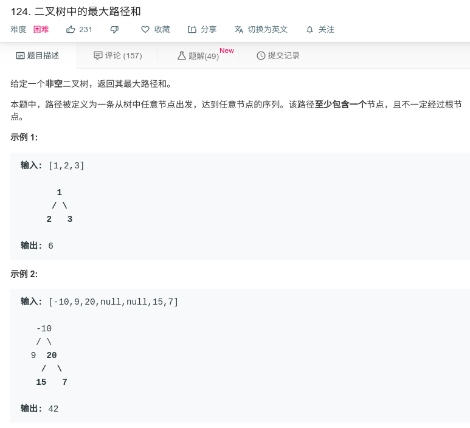

## 二叉树中的最大路径和



#### [124. 二叉树中的最大路径和](https://leetcode-cn.com/problems/binary-tree-maximum-path-sum/)

#### 思路

递归

当前节点若为最大路径中的点，要么是他和左右子树构成最大路径，要么他和左子树或右子数向上回溯构成最大路径。

因此，定义全局变量，记录最大值，然后使用后续遍历，最大值为max(当前最大值，左子树最大值+右子数最大值+当前值)， 左右子树最大值为max(0, 递归的 左右子树的左右子树最大值)。

最终递归返回结果为max(left, right) + r.val，即左子树或右子数向上回溯构成最大路径。

**注意** 递归返回的是包含当前节点的最大值。

```java
/**
 * Definition for a binary tree node.
 * public class TreeNode {
 *     int val;
 *     TreeNode left;
 *     TreeNode right;
 *     TreeNode(int x) { val = x; }
 * }
 */

/**
对于任意一个节点, 如果最大和路径包含该节点, 那么只可能是两种情况:
1. 其左右子树中所构成的和路径值较大的那个加上该节点的值后向父节点回溯构成最大路径
2. 左右子树都在最大路径中, 加上该节点的值构成了最终的最大路径
**/
class Solution {
    private int ret = Integer.MIN_VALUE;
    public int maxPathSum(TreeNode root) {
        getMax(root);
        return ret;
    }
    public int getMax(TreeNode r){
        if(r == null){
            return 0;
        }
        int left = Math.max(0, getMax(r.left));// 如果子树路径和为负则应当置0表示最大路径不包含子树
        int right = Math.max(0, getMax(r.right));
        ret = Math.max(ret, r.val + left + right); // 判断在该节点包含左右子树的路径和是否大于当前最大路径和
        return Math.max(left, right) + r.val;
    }
}
```

