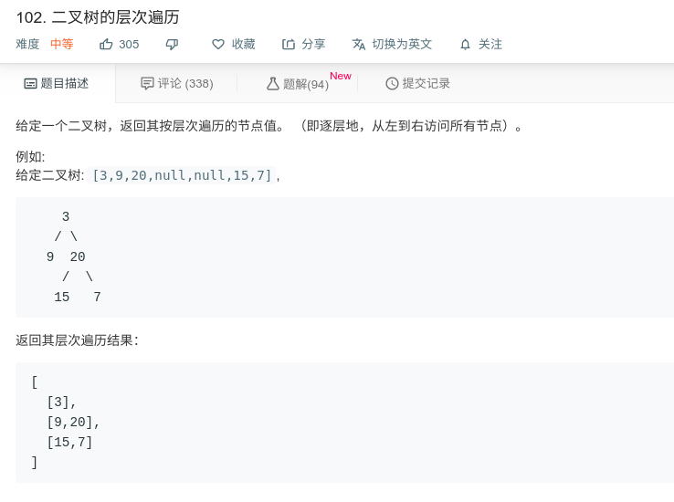

## 二叉树的层序遍历



#### [102. 二叉树的层次遍历](https://leetcode-cn.com/problems/binary-tree-level-order-traversal/)

#### 思路

使用队列，先进先出。

```java
/**
 * Definition for a binary tree node.
 * public class TreeNode {
 *     int val;
 *     TreeNode left;
 *     TreeNode right;
 *     TreeNode(int x) { val = x; }
 * }
 */
class Solution {
    public List<List<Integer>> levelOrder(TreeNode root) {

        List<List<Integer>> res = new ArrayList<>();
        if (root == null){
            return res;
        }
        Deque<TreeNode> stack = new LinkedList<>();
        stack.add(root);
        
        while(!stack.isEmpty()){
            int len = stack.size();
            List<Integer> layer = new ArrayList();

            for (int i = 0; i < len; i++){
                TreeNode tmp = stack.poll();
                System.out.println(tmp.val);
                layer.add(tmp.val);
                if (tmp.left!=null)
                    stack.add(tmp.left);
                if (tmp.right!=null)
                    stack.add(tmp.right);
            }
            res.add(layer);
        }
        return res;
    }
}
```

