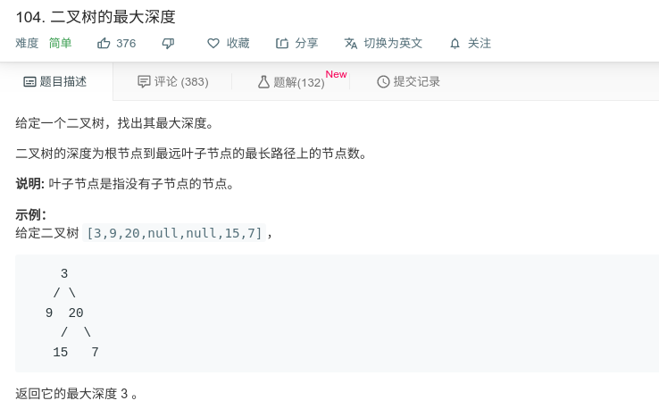

## 二叉树的最大深度



#### [104. 二叉树的最大深度](https://leetcode-cn.com/problems/maximum-depth-of-binary-tree/)

#### 思路

递归，后序遍历

返回条件：

1.若当前节点为null，返回0；

2.若当前节点不为null，返回左节点与右节点中较大的那个，并加1；


```java
/**
 * Definition for a binary tree node.
 * public class TreeNode {
 *     int val;
 *     TreeNode left;
 *     TreeNode right;
 *     TreeNode(int x) { val = x; }
 * }
 */
class Solution {
    public int maxDepth(TreeNode root) {
        return maxNum(root);
    }
    public int maxNum(TreeNode root){
        if (root == null){
            return 0;
        }
        int left = maxNum(root.left);
        int right = maxNum(root.right);
        if (left > right){
            return left+1;
        }else{
            return right+1;
        }
    }
}
```

