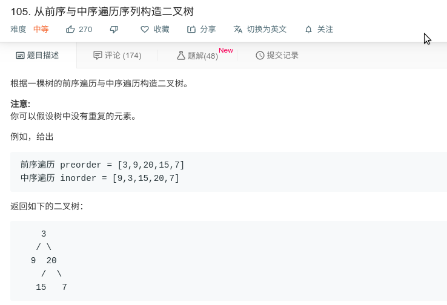

## 从前序与中序遍历序列构造二叉树



#### [105. 从前序与中序遍历序列构造二叉树](https://leetcode-cn.com/problems/construct-binary-tree-from-preorder-and-inorder-traversal/)

#### 思路

递归

前序遍历第一个值为其根节点，根节点的位置在中序遍历中使其分为左右两个子树。 

前序遍历的值一直为根节点，先左后右。

```java
/**
 * Definition for a binary tree node.
 * public class TreeNode {
 *     int val;
 *     TreeNode left;
 *     TreeNode right;
 *     TreeNode(int x) { val = x; }
 * }
 */
class Solution {
    int pre_idx = 0;
    int[] preorder;
    int[] inorder;
    HashMap<Integer, Integer> idx_map = new HashMap<Integer, Integer>();

    public TreeNode buildTree(int[] preorder, int[] inorder) {
        this.preorder = preorder;
        this.inorder = inorder;
        int idx = 0;
        for (Integer val : inorder)
          idx_map.put(val, idx++);
        return helper(0, inorder.length);
    }
    
    public TreeNode helper(int in_left, int in_right){
        if (in_left==in_right)
            return null;
        int root_val = preorder[pre_idx];
        TreeNode root = new TreeNode(root_val);
        int index = idx_map.get(root.val);
        
        pre_idx++;
        root.left = helper(in_left, index);
        root.right = helper(index + 1, in_right);
        return root;
    }
}
```

