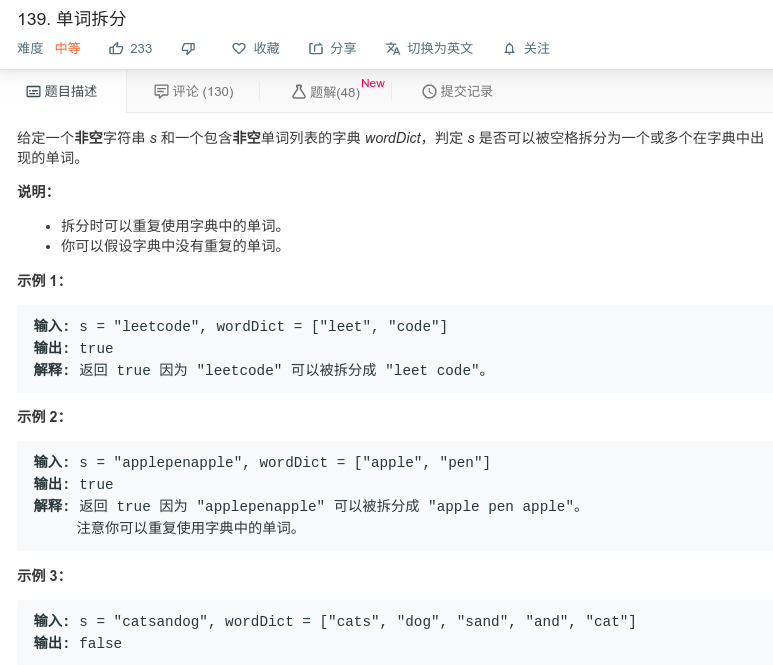

## 单词拆分



#### [139. 单词拆分](https://leetcode-cn.com/problems/word-break/)

#### 思路

使用动态规划，`dp[i]`代表的是从第一位到第`i`位是否可以拆分。

使用两个指针，i和j，循环遍历i，再循环遍历j，判断`dp[j] && wordDictSet.contains(s.substring(j, i))` 是否在map中，这表示`[0,j]`与`[j,i]`可以完成拆分。

```java
class Solution {
    public boolean wordBreak(String s, List<String> wordDict) {
        Set<String> wordDictSet = new HashSet(wordDict);
        boolean[] dp = new boolean[s.length() + 1];
        
        dp[0] = true;
        for (int i = 1; i <= s.length(); i++) {
            for (int j = 0; j < i; j++){
                if (dp[j] && wordDictSet.contains(s.substring(j, i))){
                    dp[i] = true;
                    break;
                }

            }
        }
        return dp[s.length()];
    }
}
```

