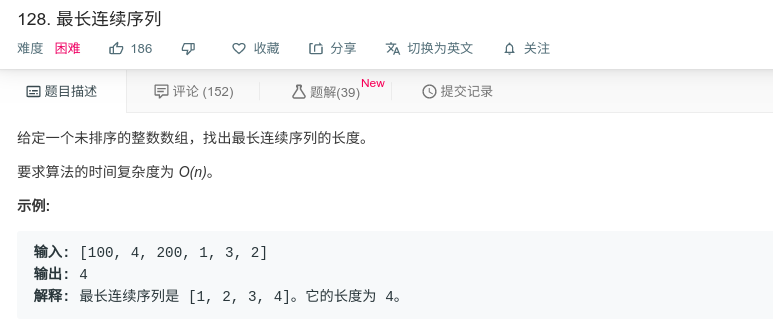

## 最长连续序列



#### [128. 最长连续序列](https://leetcode-cn.com/problems/longest-consecutive-sequence/)

#### 思路

建立set集合，将数组中的数字放入其中。

遍历数组，然后向当前元素的左边搜索，并set从中删除存在的左边元素。然后向当前元素的右边搜索，并set从中删除存在的右边元素。计算最大值，并进行下一次遍历。


```java
class Solution {
    public int longestConsecutive(int[] nums) {
        Set<Integer> numsSet = new HashSet<>();
        for(Integer num : nums){
            numsSet.add(num);
        }
        
        int longest = 0;
        for (Integer num : nums){
            if (numsSet.remove(num)){
                // 向当前元素的左边搜索,eg: 当前为100, 搜索：99，98，97,...
                int currentLongest = 1;
                int current = num;
                while (numsSet.remove(current - 1)){
                    current--;
                }
                currentLongest += (num - current);
		        // 向当前元素的右边搜索,eg: 当前为100, 搜索：101，102，103,...
                current = num;
                while (numsSet.remove(current + 1)){
                    current++;
                }
                currentLongest += (current - num);
                longest = Math.max(longest, currentLongest);
            }
        }
        return longest;
    }
}
```

