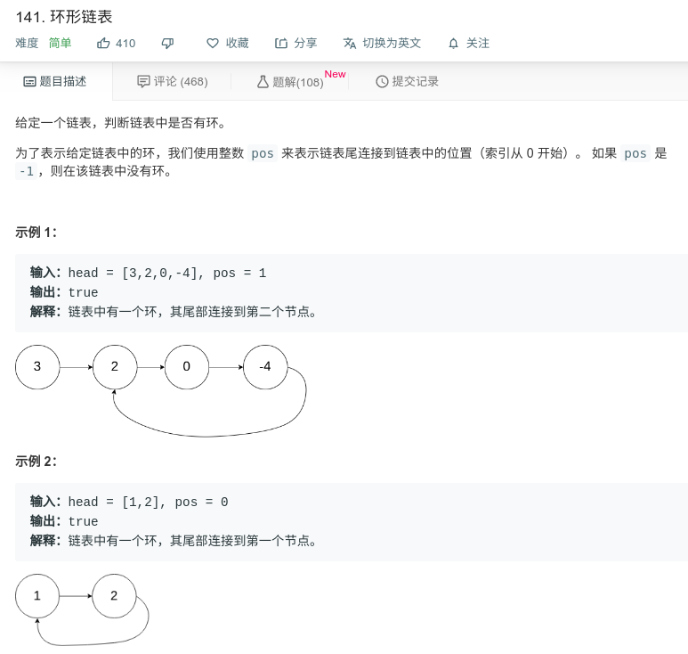

## 环形链表



#### [141. 环形链表](https://leetcode-cn.com/problems/linked-list-cycle/)

#### 思路

使用双指针，快指针一次走两步，慢指针一次一步，若有回环，则两指针必会相遇。若不相遇，则快指针会率先到达末尾。

```java
public class Solution {
    public boolean hasCycle(ListNode head) {
        if (head == null || head.next == null) {
            return false;
        }
        ListNode slow = head;
        ListNode fast = head.next;
        while (slow != fast) {
            if (fast == null || fast.next == null) {
                return false;
            }
            slow = slow.next;
            fast = fast.next.next;
        }
        return true;
    }
}
```

