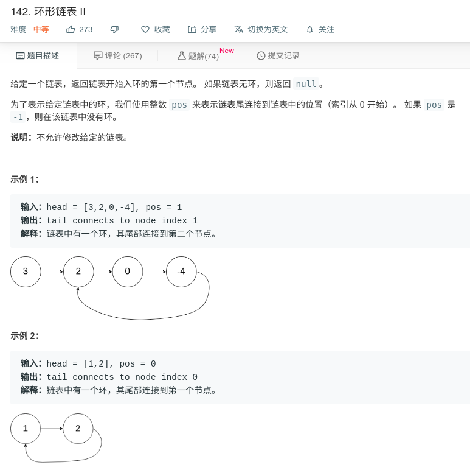

## 环形链表2



#### [142. 环形链表 II](https://leetcode-cn.com/problems/linked-list-cycle-ii/)

#### 思路

先遍历一遍链表，使用快慢指针，找到交点，然后将慢指针置为头结点，快慢指针同时一次一步，最终相交的点即为入环点。

```java
/**
 * Definition for singly-linked list.
 * class ListNode {
 *     int val;
 *     ListNode next;
 *     ListNode(int x) {
 *         val = x;
 *         next = null;
 *     }
 * }
 */
public class Solution {
    public ListNode detectCycle(ListNode head) {
        if (head == null || head.next==null){
            return null;
        }
        ListNode fast = head.next.next;
        ListNode slow = head.next;
        
        while (fast != slow) {
            if (fast==null || fast.next==null){
                return null;
            }
            fast = fast.next.next;
            slow = slow.next;
        }
        slow = head;
        while (fast!=slow){
            slow = slow.next;
            fast = fast.next;
        }
        return fast;
    }
}
```

