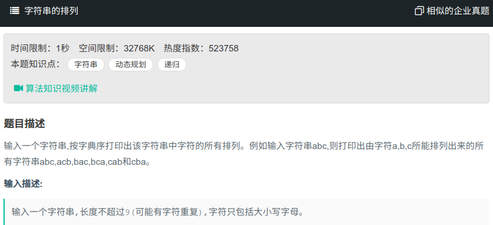

## 字符串的排列



#### [字符串的排列](https://www.nowcoder.com/practice/fe6b651b66ae47d7acce78ffdd9a96c7?tpId=13&tqId=11180&tPage=2&rp=1&ru=%2Fta%2Fcoding-interviews&qru=%2Fta%2Fcoding-interviews%2Fquestion-ranking)

#### 思路

字符串的排列可以认为是当前字符与后面其他字符的交换加上下一个字符与再后面的字符交换，以此类推。

使用递归，递归结束条件为当前字符为最后一个字符，否则每次递归转换当前数字与其余后面的数字。再进入递归

递归结束后需要将其调换回来。

```java
import java.util.ArrayList;
import java.util.Collections;

public class Solution {
    ArrayList<String> res = new ArrayList<String>();
    public ArrayList<String> Permutation(String str) {
        if(str == null)
            return res;
        PermutationHelper(str.toCharArray(), 0);
        Collections.sort(res);
        return res;
    }
    public void PermutationHelper(char [] str, int i){
        if (i==str.length-1){
            res.add(String.valueOf(str));
        }else{
            for (int j = i; j<str.length; j++){
                if (i!=j && str[i]==str[j]){
                    continue;
                }
                swap(str, i, j);
                PermutationHelper(str, i+1);
                swap(str, i, j);
            }
        }
    }
    public void swap(char[] str, int i, int j) {
        char temp = str[i];
        str[i] = str[j];
        str[j] = temp;
    }
}
```

