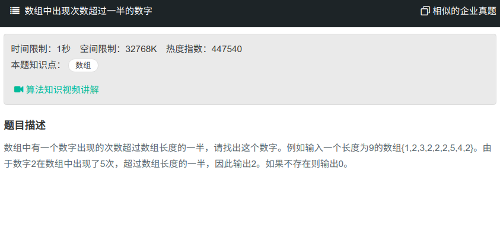

## 数组最终出现次数超过一半的数字



#### [数组最终出现次数超过一半的数字](https://www.nowcoder.com/practice/e8a1b01a2df14cb2b228b30ee6a92163?tpId=13&tqId=11181&tPage=2&rp=1&ru=%2Fta%2Fcoding-interviews&qru=%2Fta%2Fcoding-interviews%2Fquestion-ranking)

#### 思路

使用一个值num来记录当前最多出现的值，n为次数，遍历数组，若与num值相同，则n+1，若不同，则n-1。若n为0，则改变num中的数值为当前数组数。

**注意**：最后还需遍历一次，来判断是否是超过一般的值。

```java
public class Solution {
    public int MoreThanHalfNum_Solution(int [] array) {
        if(array.length==0 || array==null){
            return 0;
        }
        int num = array[0];
        int n = 1;
        for (int i = 1; i<array.length; i++){
            if (num == array[i]){
                n = n + 1;
            }else if(n==0){
                num = array[i];
                n = 1;
            }else{
                n = n-1;
            }
        }        
        int times = 0;
        for(int i = 0; i < array.length; i++){
            if(array[i] == num){
                times++;
            }
        }
        if(times <= array.length / 2){
            return 0;
        }
        return num;  
        
    }
}
```

