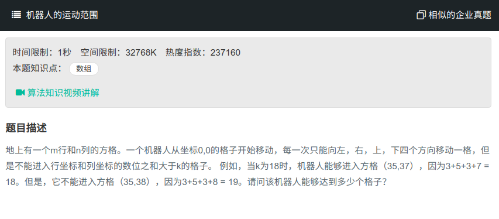

## 机器人的运动范围



#### [机器人的运动范围](https://www.nowcoder.com/practice/6e5207314b5241fb83f2329e89fdecc8?tpId=13&tqId=11219&tPage=4&rp=1&ru=%2Fta%2Fcoding-interviews&qru=%2Fta%2Fcoding-interviews%2Fquestion-ranking)

#### 思路

使用回溯。

先创建一个与矩阵相同大小的矩阵，用于判断当前格子是否已经用过。

然后分别遍历其上下左右，看是否满足条件，若满足，则继续回溯，若不满足，则结束本次回溯。

```java
public class Solution {
    public int movingCount(int threshold, int rows, int cols){
        if (rows <= 0 || cols <= 0 || threshold < 0)
            return 0;
        int[][] isVisited = new int[rows][cols];
        int count = 0;
        int nums = movingCountCore (threshold, rows, cols, 0, 0, isVisited);
        return nums;
    }
    
    public int movingCountCore (int threshold, int rows, int cols, int row, int col, int[][] isVisited){
        if (row < 0 || col < 0 || row >= rows || col >= cols || isVisited[row][col] == 1 || cal(row) + cal(col) > threshold){
            return 0;
        }
        isVisited[row][col] = 1;
        return 1 + movingCountCore(threshold, rows, cols, row - 1, col, isVisited)
                + movingCountCore(threshold, rows, cols, row + 1, col, isVisited)
                + movingCountCore(threshold, rows, cols, row, col - 1, isVisited)
                + movingCountCore(threshold, rows, cols, row, col + 1, isVisited);
    }
    private int cal(int num) {
        int sum = 0;
        while (num > 0) {
            sum += num % 10;
            num /= 10;
        }
        return sum;
    }
}
```

