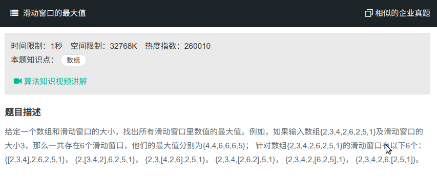

## 滑动窗口最大值



#### [滑动窗口最大值](https://www.nowcoder.com/practice/1624bc35a45c42c0bc17d17fa0cba788?tpId=13&tqId=11217&tPage=4&rp=1&ru=%2Fta%2Fcoding-interviews&qru=%2Fta%2Fcoding-interviews%2Fquestion-ranking)

#### 思路

使用双端队列`ArrayDeque`，队列的头保存窗口中的最大值。

循环后移，先判断队列是否为空，再判断队列头是否已经不在窗口中，然后循环检查当前队列尾是否小于当前数，小于则弹出。

```java
import java.util.ArrayList;
import java.util.ArrayDeque;
public class Solution {
    public ArrayList<Integer> maxInWindows(int [] num, int size){
        ArrayList<Integer> res = new ArrayList<>();
        if(size == 0) return res;
        int begin;
        ArrayDeque<Integer> q = new ArrayDeque<>();
        for (int i = 0; i < num.length; i++){
            begin = i - size + 1;
            if (q.isEmpty()){
                q.add(i);
            }else if(begin > q.peekFirst()){
                q.pollFirst();
            }
            
            while((!q.isEmpty()) && num[q.peekLast()] <= num[i]){
                q.pollLast();
            }
            q.add(i);
            if (begin >= 0){
                res.add(num[q.peekFirst()]);
            }
        }
        return res;
    }
}
```

