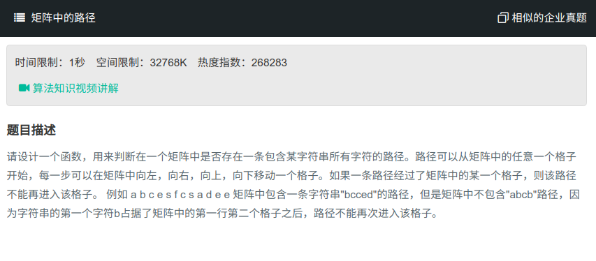

## 矩阵中的路径



#### [矩阵中的路径](https://www.nowcoder.com/practice/c61c6999eecb4b8f88a98f66b273a3cc?tpId=13&tqId=11218&tPage=4&rp=1&ru=%2Fta%2Fcoding-interviews&qru=%2Fta%2Fcoding-interviews%2Fquestion-ranking)

#### 思路

使用回溯。

先创建一个与字符矩阵相同大小的矩阵，用于判断字符矩阵中的字符是否已经用过，然后遍历每一个字符，即以每一个字符为起点回溯判断。

若超出边界或字符不相等或已经用过，则return。否则判断是否是最后一个字符，若是则返回，若不是，则将当前字符置为用过，继续回溯。一轮回溯结束后需要将置为用过的字符再变为没有用过。

```java
public class Solution {
    public boolean hasPath(char[] matrix, int rows, int cols, char[] str){

        int[][] flag = new int[rows][cols];
        int pathLength = 0;
        for (int i = 0; i < rows; i++){
            for (int j = 0; j < cols; j++){
                if (hasPathCore(matrix, rows, cols, i, j, str, pathLength, flag)){
                    return true;
                }
            }
        }
        return false;
    }
    
    public boolean hasPathCore(char[] matrix, int rows, int cols, int row, int col, 
                               char[] str, int pathLength, int[][] isVisited){
        if (row < 0 || col < 0 || row >= rows || col >= cols || isVisited[row][col] == 1
                        || str[pathLength] != matrix[row * cols + col]){
            return false;
        }
        if (pathLength == str.length - 1)
            return true;
        boolean hasPath = false;
        isVisited[row][col] = 1;
        hasPath = hasPathCore(matrix, rows, cols, row - 1, col, str, pathLength + 1, isVisited)
                        || hasPathCore(matrix, rows, cols, row + 1, col, str, pathLength + 1, isVisited)
                        || hasPathCore(matrix, rows, cols, row, col - 1, str, pathLength + 1, isVisited)
                        || hasPathCore(matrix, rows, cols, row, col + 1, str, pathLength + 1, isVisited);
        isVisited[row][col] = 0;
        return hasPath;
    }
}
```

