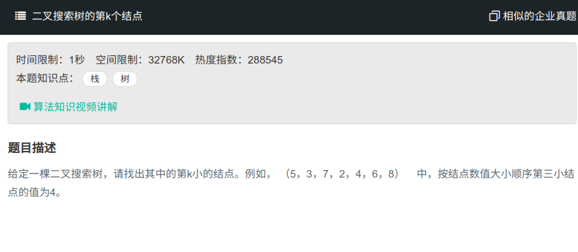

## 二叉搜索树的第k个节点



#### [二叉搜索树的第k个节点](https://www.nowcoder.com/practice/ef068f602dde4d28aab2b210e859150a?tpId=13&tqId=11215&tPage=4&rp=1&ru=%2Fta%2Fcoding-interviews&qru=%2Fta%2Fcoding-interviews%2Fquestion-ranking)

#### 思路

二叉树的中序遍历是单调递增的。

使用中序遍历，但需要注意返回时若当前返回值不为null，则直接返回，不用判断。

```java
/*
public class TreeNode {
    int val = 0;
    TreeNode left = null;
    TreeNode right = null;

    public TreeNode(int val) {
        this.val = val;

    }

}
*/
public class Solution {
    int index = 0;
    TreeNode KthNode(TreeNode pRoot, int k){
        if (pRoot!=null){
            TreeNode node = KthNode(pRoot.left, k);
            if (node!=null){//此处是重点，得到第k个节点后直接返回，不必再判断了
                return node;
            }
            index++;
            if (index==k){
                return pRoot;
            }
            node = KthNode(pRoot.right, k);
            if (node!=null){
                return node;
            }
        }
        return null;
    }
}

```

