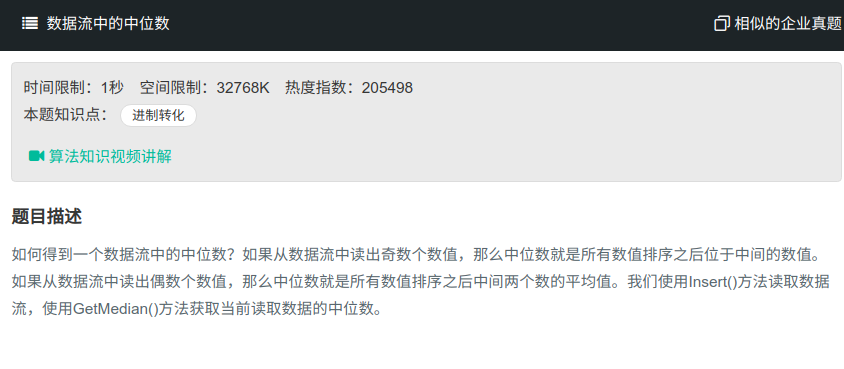

## 数据流中的中位数



#### [数据流中的中位数](https://www.nowcoder.com/practice/9be0172896bd43948f8a32fb954e1be1?tpId=13&tqId=11216&tPage=4&rp=1&ru=%2Fta%2Fcoding-interviews&qru=%2Fta%2Fcoding-interviews%2Fquestion-ranking)

#### 思路

使用大根堆与小根堆。

首先创建全局的两个堆，在插入时先判断两个堆中的总个数为奇数还是偶数，若为奇数，则插入小根堆，若为偶数，则插入大根堆。再插入大根堆前，还需判断当前数是否大于小根堆的最小值（堆顶），若大于，则将小根堆的最大值取出，放入大根堆。反之也是如此。总的来说，就是大根堆的最大值（堆顶）小于小根堆的最小值（堆顶）。

在计算中位数时，若两堆总数为奇数，则返回大根堆堆顶，否则返回大根堆与小根堆堆顶和除以二。

```java
import java.util.PriorityQueue;
import java.util.Comparator;
public class Solution {
    PriorityQueue<Integer> minHeap = new PriorityQueue<Integer>(); //小顶堆，默认容量为11
    PriorityQueue<Integer> maxHeap = new PriorityQueue<Integer>(11,new Comparator<Integer>(){ //大顶堆，容量11
        public int compare(Integer i1,Integer i2){
            return i2-i1;
        }
    });
    public void Insert(Integer num) {
        if(((minHeap.size()+maxHeap.size())&1)==0){//偶数时,下个数字加入小顶堆
            if(!maxHeap.isEmpty() && maxHeap.peek()>num){
                maxHeap.offer(num);
                num=maxHeap.poll();
            }
            minHeap.offer(num);
        }else{//奇数时，下一个数字放入大顶堆
            if(!minHeap.isEmpty() && minHeap.peek()<num){
                minHeap.offer(num);
                num=minHeap.poll();
            }
            maxHeap.offer(num);
        }
    }
 
    public Double GetMedian() {
        if((minHeap.size()+maxHeap.size())==0)
            throw new RuntimeException();
        double median;
        if((minHeap.size()+maxHeap.size()&1)==0){
            median=(maxHeap.peek()+minHeap.peek())/2.0;
        }else{
            median=minHeap.peek();
        }
        return median;
    }

}
```

