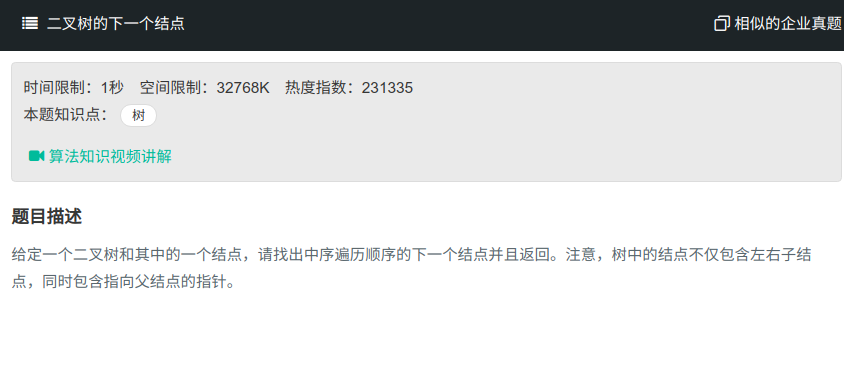

## 二叉树的下一个节点



#### [二叉树的下一个节点](https://www.nowcoder.com/practice/9023a0c988684a53960365b889ceaf5e?tpId=13&tqId=11210&tPage=3&rp=1&ru=%2Fta%2Fcoding-interviews&qru=%2Fta%2Fcoding-interviews%2Fquestion-ranking)

#### 思路

中序遍历的下一个节点分为两种情况

第一种：若当前节点存在右子树，则下一个节点为其右子树中的最左节点。

第二种：若无右子数，则当前节点的下一个节点为其父节点向上，知道某一父节点为其父节点的左子树。

```java
/*
public class TreeLinkNode {
    int val;
    TreeLinkNode left = null;
    TreeLinkNode right = null;
    TreeLinkNode next = null;

    TreeLinkNode(int val) {
        this.val = val;
    }
}
*/
public class Solution {
    public TreeLinkNode GetNext(TreeLinkNode pNode){
        TreeLinkNode temp;
        if (pNode.right != null){
            temp = pNode.right;
            while (temp.left!=null){
                temp = temp.left;
            }
            return temp;
        }
        while (pNode.next != null){
            TreeLinkNode root = pNode.next;
            if (pNode == root.left){
                return root;
            }
            pNode = root;
        }
        return null;
    }
}
```

