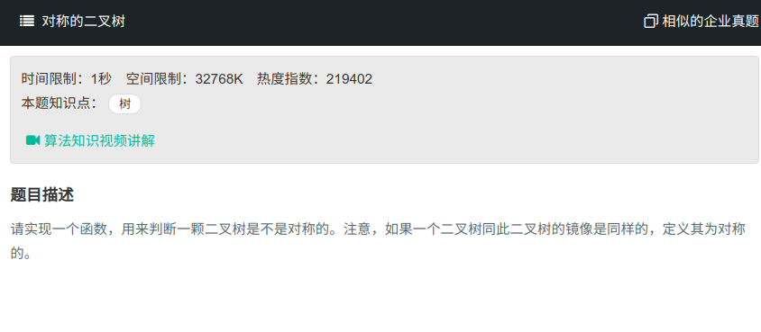

## 对称的二叉树



#### [对称的二叉树](https://www.nowcoder.com/practice/ff05d44dfdb04e1d83bdbdab320efbcb?tpId=13&tqId=11211&tPage=3&rp=1&ru=%2Fta%2Fcoding-interviews&qru=%2Fta%2Fcoding-interviews%2Fquestion-ranking)

#### 思路

使用递归，若左右都为null，则返回ture，若只有一个为null，则返回false。

若两值相等，则进行下一次递归，即判断左节点的左子树与右节点的右子树；左节点的右子树与右节点的左子树。

```java
/*
public class TreeNode {
    int val = 0;
    TreeNode left = null;
    TreeNode right = null;

    public TreeNode(int val) {
        this.val = val;

    }

}
*/
public class Solution {
    boolean isSymmetrical(TreeNode pRoot){
        if(pRoot == null)
            return true;
        return isSymmetrical(pRoot.left, pRoot.right);
    }
    
    public boolean isSymmetrical(TreeNode left, TreeNode right){
        if (left==null && right==null){
            return true;
        }
        if (left==null || right==null){
            return false;
        }
        if (left.val == right.val){
            return isSymmetrical(left.left, right.right) && 
                isSymmetrical(left.right, right.left);
        }
        return false;
    }
}
```

