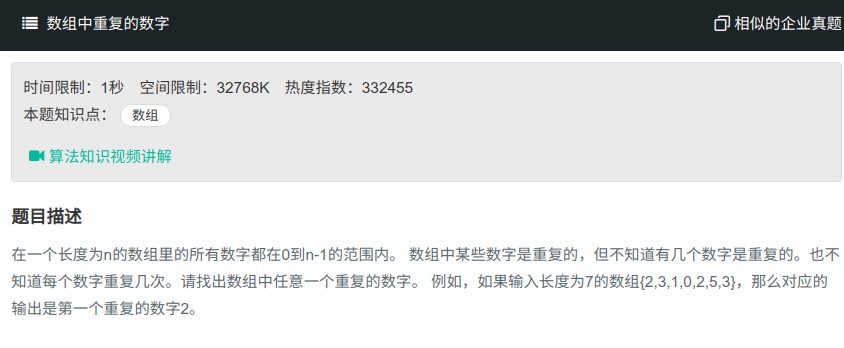

## 数组中重复的数字



#### [数组中重复的数字](https://www.nowcoder.com/practice/623a5ac0ea5b4e5f95552655361ae0a8?tpId=13&tqId=11203&tPage=3&rp=1&ru=%2Fta%2Fcoding-interviews&qru=%2Fta%2Fcoding-interviews%2Fquestion-ranking)

#### 思路

将数组中的数字排到相应的index上。

```java

public class Solution{
    public boolean duplicate(int numbers[],int length,int [] duplication) {
        if(length == 0)
            return false;
        for(int i = 0; i < length; i++){
            while(i != numbers[i]){
                if(numbers[i] == numbers[numbers[i]]){
                    duplication[0] = numbers[i];
                    return true;
                }else{
                    int temp = numbers[numbers[i]];
                    numbers[numbers[i]] = numbers[i];
                    numbers[i] = temp;
                }
            }
        }
        return false;
}
```

