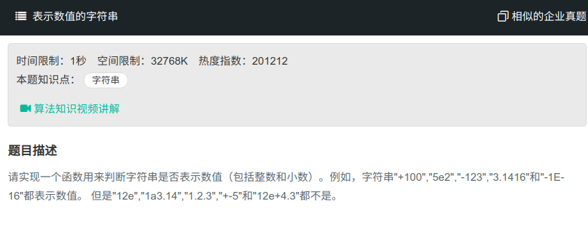

## 表示数值的字符串



#### [表示数值的字符串](https://www.nowcoder.com/practice/6f8c901d091949a5837e24bb82a731f2?tpId=13&tqId=11206&tPage=3&rp=1&ru=%2Fta%2Fcoding-interviews&qru=%2Fta%2Fcoding-interviews%2Fquestion-ranking)

#### 思路

先判断是否为`+-` ，在判断是否为`Ee`，最后判断`.` .

```java

public class Solution{
	public boolean isNumeric(char[] str){
        int len = str.length;
        boolean isSign = false, isE = false, isDot = false;
        for (int i = 0; i < len; i++){
            if (str[i]=='+' || str[i] == '-'){
                if (!isSign && str[i-1] != 'e' && str[i-1] != 'E'){
                    return false;
                }
                if (isSign && str[i-1] != 'e' && str[i-1] != 'E'){
                    return false;
                }
                isSign = true;
            }else if(str[i] == 'e' || str[i] == 'E'){
                if (i == len-1){
                    return false;//判断是否最后一位
                }
                if (isE){
                    return false;
                }
                isE = true;
            }else if(str[i] == '.'){
                if (isE || isDot){
                    return false;
                }
                isDot = true;
            }else if(str[i] < '0' || str[i] > '9'){
                return false;
            }
        }
    }
    return ture;
        
}
```

