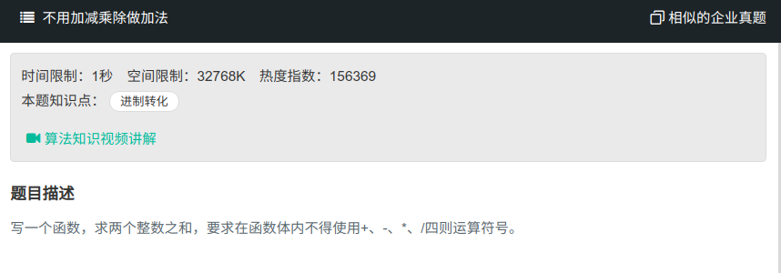

## 不用加减乘除做加法



#### [不用加减乘除做加法](https://www.nowcoder.com/practice/59ac416b4b944300b617d4f7f111b215?tpId=13&tqId=11201&tPage=3&rp=1&ru=%2Fta%2Fcoding-interviews&qru=%2Fta%2Fcoding-interviews%2Fquestion-ranking)

#### 思路

使用`^,&`进行加法操作，其中`^`代表进位，`&`代表不带进位的加法

```java
public class Solution{
	public int addNum(int a, int b){
    	int sum = 0;
        int carry = 0;
        do{
            sum = a & b;
            carry = a ^ b;
            if (carry != 0){
                a = sum;
                carry = carry << 1;
                b = carry;
            }
        }while(carry!=0);
        return sum;
    }
}
```

