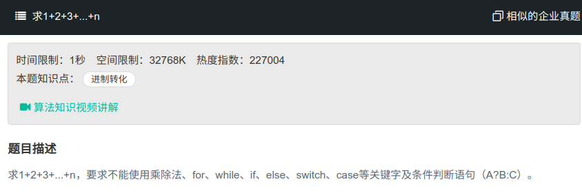

## 求1+2+3



#### [求1+2+3](https://www.nowcoder.com/practice/7a0da8fc483247ff8800059e12d7caf1?tpId=13&tqId=11200&tPage=3&rp=1&ru=%2Fta%2Fcoding-interviews&qru=%2Fta%2Fcoding-interviews%2Fquestion-ranking)

#### 思路

使用递归与&&进行判断

```java
public class Solution{
    public int temp = 0;
    public int Sum_Solution(int n) {
        complex(n);
        return temp;
    }
    public int complex(int n){
        boolean flag = n>0 && (temp=temp+n)>0 && complex(n-1);
        return temp;
    }
}
```

