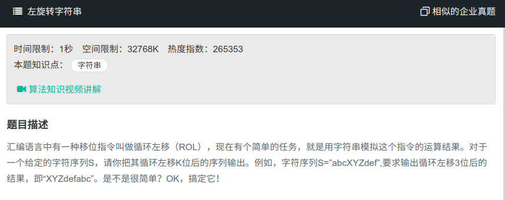

## 左旋字符串



#### [左旋字符串](https://www.nowcoder.com/practice/12d959b108cb42b1ab72cef4d36af5ec?tpId=13&tqId=11196&tPage=3&rp=1&ru=%2Fta%2Fcoding-interviews&qru=%2Fta%2Fcoding-interviews%2Fquestion-ranking)

#### 思路

先旋转前n项，再旋转n后的字符，最终全部旋转。

```java
public class Solution{
    public String LeftRotateString(String str,int n) {
		char[] ch = str.toCharArray();
        reverse(ch, 0, n-1);
        reverse(ch, n, ch.length - 1);
        reverse(ch, 0, ch.length - 1);
        return String(ch);
    }
    public void reverse (char[] ch, int start, int end) {
        while (start<end){
            char c = ch[end];
            ch[end] = ch[start];
            ch[start] = c;
            start++;
            end--;
        }
    }
}
```

