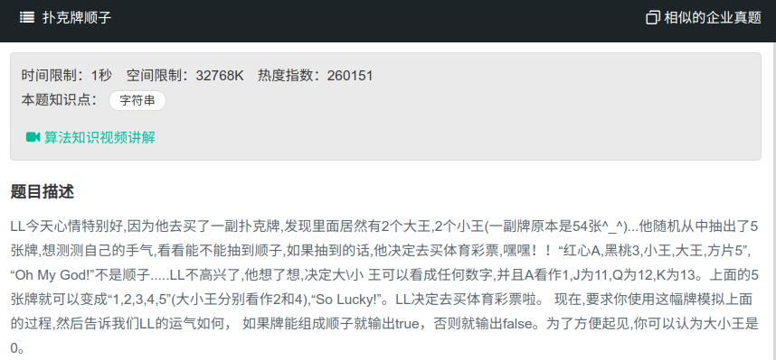

## 扑克牌顺子



#### [扑克牌顺子](https://www.nowcoder.com/practice/762836f4d43d43ca9deb273b3de8e1f4?tpId=13&tqId=11198&tPage=3&rp=1&ru=%2Fta%2Fcoding-interviews&qru=%2Fta%2Fcoding-interviews%2Fquestion-ranking)

#### 思路

先整体反转，再按空格逐单词反转。

```java
import java.util.*;
import java.util.Arrays;
public class Solution {
    public boolean isContinuous(int [] numbers) {
        if (numbers == null || numbers.length < 5) {
            return false;
        }
        Arrays.sort(numbers);
        int cnt = 0;
        for (int num : numbers) {
            if (num == 0) {
                cnt++;
            }
        }
        int ksum = 0;
        for (int i = 0; i < numbers.length - 1; i++) {
            int a = numbers[i];
            int b = numbers[i + 1];
            if (a == 0 || b == 0) {
                continue;
            }
            if (b == a) {
                return false;
            }
            ksum += b - a - 1;
        }
        if ((cnt != 0 && ksum == cnt)|| ksum ==0) {
            return true;
        }
        return false;
    }
}
```

